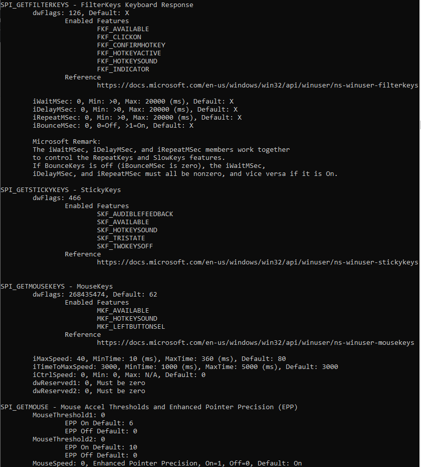

# About
Python wrapper for extracting info about Keyboard, Mouse and Ease of Access settings from memory using Windows Api. Not fully object oriented, just something to quickly access and display the data.

# Basic use
* Import the file into your python project
```
import pySystemParametersInfoW
```
* Initialize the Windows API object
```
spi = pySystemParametersInfoW()
```
- Call the functions
```
spi.SPI_GETFILTERKEYS()
spi.SPI_GETSTICKYKEYS()
spi.SPI_GETMOUSEKEYS()
spi.SPI_GETMOUSE()
spi.SPI_GETKEYBOARDDELAY()
spi.SPI_GETKEYBOARDSPEED()
```

## Output

